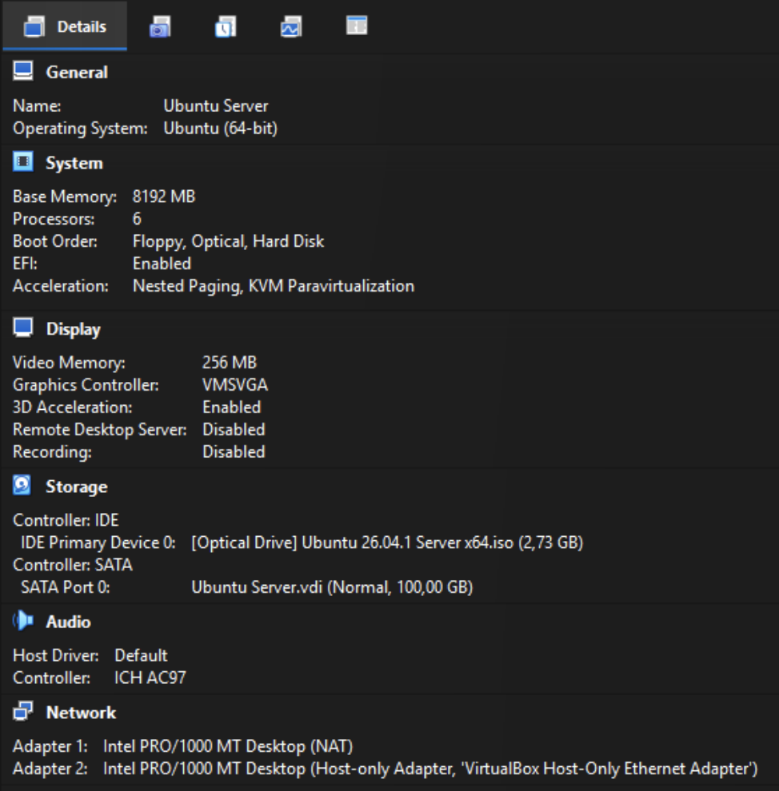

# Fitxa tècnica: Instalació d'Ubuntu Server 26.04

## Objectiu

Documentar el procés d’instal·lació d’**Ubuntu Server 26.04** de manera clara i ordenada.
Recollir les comprovacions realitzades i les possibles incidències durant la instal·lació.

## Materials

- [ ] Ordinador o màquina virtual amb connexió a Internet.
- [ ] Imatge ISO d’Ubuntu Server 26.04.
- [ ] Memòria USB d’arrencada o eina de virtualització.
- [ ] Usuari i contrasenya per configurar el sistema.

## Procediment

1. **Descarregar** la imatge ISO d’Ubuntu Server 26.04 des del [lloc web oficial](https://ubuntu.com/download/server).
2. Crear una màquina virtual _(per exemple, a VirtualBox)_ o preparar una memòria USB d’arrencada amb la ISO.

_Configuració de exemple._

3. Iniciar l’ordinador o la màquina virtual des de la ISO.
4. Seleccionar l’idioma, la distribució del teclat i la configuració de xarxa.
5. Escollir el disc d’instal·lació i confirmar-ne l’ús.
6. Crear l’usuari administrador i definir una contrasenya segura.
7. Revisar el resum de la configuració i iniciar la instal·lació.
8. Reiniciar el sistema quan l’instal·lador ho indiqui i retirar la ISO o la memòria USB.
9. Iniciar sessió amb l’usuari creat.

## Comprovacions

- [ ] El sistema inicia correctament sense la ISO d’instal·lació.
- [ ] La xarxa funciona i l’equip té una adreça IP.
- [ ] L’usuari creat pot iniciar sessió.
- [ ] Es pot obrir un terminal i executar una ordre, per exemple `ip addr`.

## Incidències i solucions

| Incidència | Solució |
| --- | --- |
| La màquina no arrenca des de la ISO. | Revisar l’ordre d’arrencada i comprovar que la ISO sigui correcta. |
| No hi ha connexió de xarxa. | Revisar la configuració de l’adaptador de xarxa de la màquina virtual o del dispositiu. |
| La contrasenya no és acceptada. | Tornar a introduir-la i comprovar que compleixi els requisits indicats. |

## Recursos

- [Documentació oficial d’Ubuntu Server](https://documentation.ubuntu.com/server/)
- [Pàgina de descàrrega d’Ubuntu](https://ubuntu.com/download/server)
